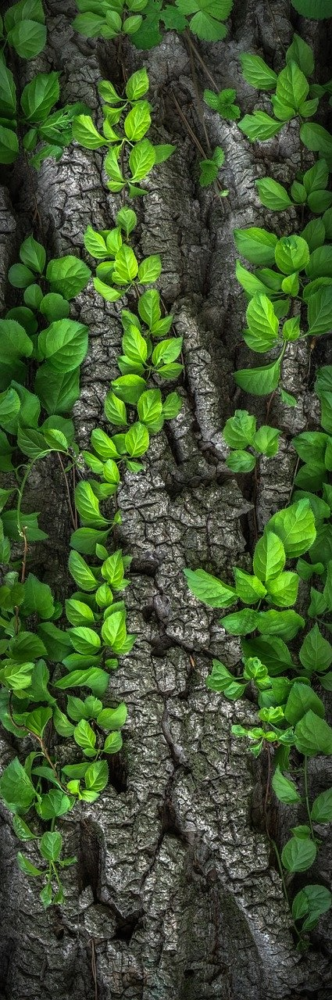
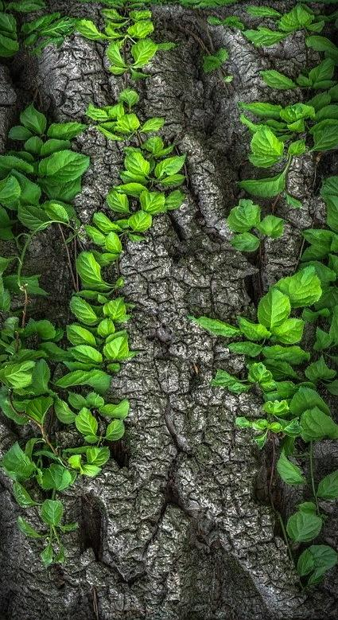

# Seam-Carver

Seam carving is a content-aware resizing image technique. It allows images to be resized with minimal distortion and without losing important content, unlike other methods of sizing such as cropping or rescaling. In order to do so, it removes horizontal or vertical "seams" from the image until the image reaches the appropriate size, where a seam is a connected path between opposite edges of an image. 

The seam is chosen based on the energy of each pixel. In this case, the energy is calculated using the dual-gradient energy function, where the x-gradient (used for removing horizontal seams) is the sum of the square of the absolute differences between a pixel's RGB values and those of its horizontal neighbours. The y-gradient is calculated in a similar fashion. At each step, the cost of all the paths from one edge of an image to the opposite edge are found, where the cost of a path is the sum of all the energies of the pixels on the path. The minimum cost (shortest) path is found using topological sort, and the pixels on the minimum cost path are removed, thus reducing the width/height of the image by 1 pixel. 

Intuituvely, the algorithm removes a seam whose pixels have the least difference in gradient, so this seam would be the least noticeable to remove. 

## Testing Examples

Original image dimensions: 1280 x 738

Resized image dimensions: 780 x 738 (500 vertical seams removed)

Original image dimensions: 640 x 426

Resized image dimensions: 440 x 426 (200 vertical seams removed)

Original image dimensions: 425 x 1279

Resized image dimensions: 425 x 779 (500 horizontal seams removed)

